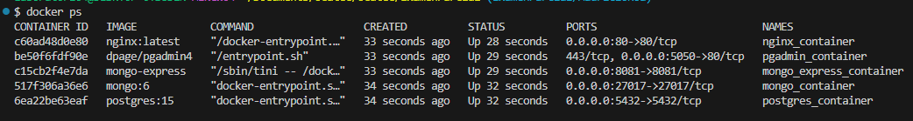
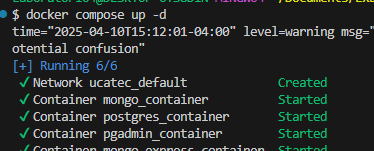
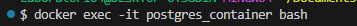
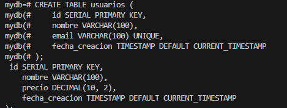
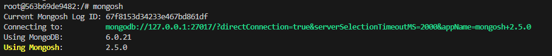
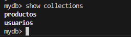

# Guía para Crear y Levantar PostgreSQL, MongoDB y Nginx con Docker Compose

Este tutorial te guiará a través de los pasos para crear un archivo `docker-compose.yml` que levante los servicios de PostgreSQL, MongoDB y Nginx, así como también te mostrará cómo crear tablas y colecciones, y cómo ver las tablas y colecciones en ambos sistemas de bases de datos.

## Paso 1: Crear el archivo `docker-compose.yml`

Crea un archivo llamado `docker-compose.yml` en el directorio donde quieras gestionar tu proyecto. Este archivo debe contener la configuración para los servicios de PostgreSQL, MongoDB y Nginx.

### `docker-compose.yml`

```yaml
version: '3.8'

services:
  postgres:
    image: postgres:15
    container_name: postgres_container
    environment:
      POSTGRES_USER: admin
      POSTGRES_PASSWORD: admin123
      POSTGRES_DB: mydb
    ports:
      - "5432:5432"
    volumes:
      - postgres_data:/var/lib/postgresql/data

  pgadmin:
    image: dpage/pgadmin4
    container_name: pgadmin_container
    environment:
      PGADMIN_DEFAULT_EMAIL: admin@example.com
      PGADMIN_DEFAULT_PASSWORD: admin123
    ports:
      - "5050:80"
    depends_on:
      - postgres

  mongo:
    image: mongo:6
    container_name: mongo_container
    ports:
      - "27017:27017"
    volumes:
      - mongo_data:/data/db

  mongo-express:
    image: mongo-express
    container_name: mongo_express_container
    environment:
      ME_CONFIG_MONGODB_SERVER: mongo
      ME_CONFIG_MONGODB_ADMINUSERNAME: ""
      ME_CONFIG_MONGODB_ADMINPASSWORD: ""
    ports:
      - "8081:8081"
    depends_on:
      - mongo

  nginx:
    image: nginx:latest
    container_name: nginx_container
    ports:
      - "80:80"
    volumes:
      - ./nginx.conf:/etc/nginx/nginx.conf:ro
    depends_on:
      - pgadmin
      - mongo-express

volumes:
  postgres_data:
  mongo_data:
```
  Crear archivo nginx.cong con el siguiente codigo
```bash
events {}

http {
  server {
    listen 80;

    location /pgadmin/ {
      proxy_pass http://pgadmin:80/;
    }

    location /mongo-express/ {
      proxy_pass http://mongo-express:8081/;
    }
  }
}
server {
    listen 80;
    server_name localhost;

    location / {
        root /usr/share/nginx/html;
        index index.html;
    }
}
```

  Para comprobar haz un
  ```bash
  docker ps
  ```
 
  ## Paso 2: Poner arriba `docker-compose.yml`
```bash
 docker-compose up -d
 ```
 
##Paso 3: Crear Tablas en PostgreSQL
```bash
docker exec -it postgres_container bash
```

```bash
psql -U admin -d mydb
```
```bash
CREATE TABLE usuarios (
    id SERIAL PRIMARY KEY,
    nombre VARCHAR(100),
    email VARCHAR(100) UNIQUE,
    fecha_creacion TIMESTAMP DEFAULT CURRENT_TIMESTAMP
);

CREATE TABLE productos (
    id SERIAL PRIMARY KEY,
    nombre VARCHAR(100),
    precio DECIMAL(10, 2),
    fecha_creacion TIMESTAMP DEFAULT CURRENT_TIMESTAMP
);
```



##Paso 4: Crear Colecciones en MongoDB
```bash
docker exec -it mongo_container bash
```

Ingresa a la shell de MongoDB:
```bash
mongosh
```

Selecciona la base de datos mydb (si no existe, MongoDB la creará automáticamente)
```bash
use mydb
```
Para ver las colecciones, usa el siguiente comando:
```bash
show collections
```

